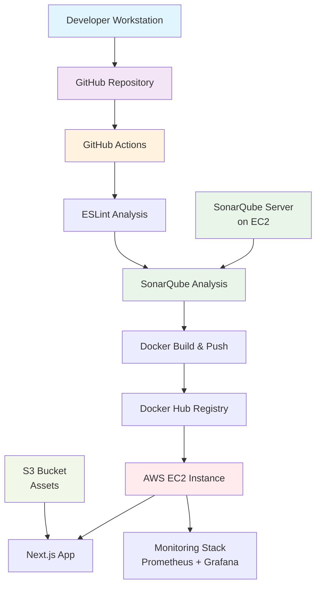
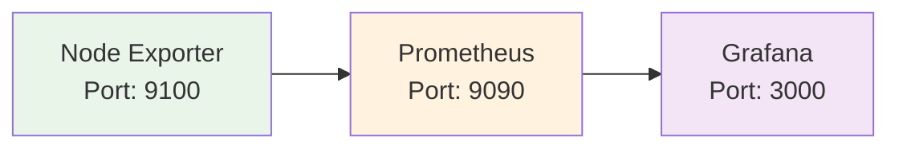

# DevOps: SonarQube-Driven CI/CD Pipeline for Next.js App

## Table of Contents

1. [Architecture Design](#architecture-design)
2. [Part 1: Setup & Linting](#part-1-setup--linting)
3. [Part 2: SonarQube Quality Analysis](#part-2-sonarqube-quality-analysis)
4. [Part 3: Dockerize & Push](#part-3-dockerize--push)
5. [Part 4: Deploy to AWS EC2](#part-4-deploy-to-aws-ec2)
6. [Part 5: S3 Static Assets](#part-5-s3-static-assets)
7. [Part 6: Monitoring](#part-6-monitoring)
8. [Challenges Faced](#challenges-faced)
9. [Key Learnings](#key-learnings)

## Architecture Design

### System Architecture

### Architecture Rationale

**Multi-Stage Pipeline:** Sequential quality gates ensure code quality at each stage with fail-fast approach.

**Container-First:** Consistent environments across all stages with improved security and scalability.

**Cloud-Native Monitoring:** Real-time observability with proactive alerting and resource optimization.

**Asset Management:** S3 provides global CDN benefits with cost-effective, scalable storage.

---

## Part 1: Setup & Linting

### Next.js Project Preparation

**Repository Setup:**
- Used the Next Japan repository with Next.js 15, React 19, and Tailwind CSS 4
- Ensured all dependencies are up to date with automatic dependency checking
- Configured ESLint with `eslint.config.mjs` for modern JavaScript linting

### ESLint Configuration

**Key Features:**
- **Modern Configuration:** Uses ESLint flat config format
- **Dependency Management:** Automatic outdated dependency detection and updates
- **Caching:** Optimized node_modules caching for faster builds
- **Quality Gates:** Pipeline fails on any ESLint errors

**Implementation Highlights:**
- Automatic dependency checking and updates
- Optimized node_modules caching
- Comprehensive error reporting with GitHub Job Summary

**Screenshots**  

<em><b>Linting CI Summary</b></em>

---

<em><b>Linting Error = Pipeline Failed</b></em>

---

<em><b>Linting Error Summary</b></em>

---

## Part 2: SonarQube Quality Analysis

### SonarQube Setup

**Self-Hosted Configuration:**
- **Container:** SonarQube Community Edition on EC2
- **Database:** PostgreSQL 15 for data persistence
- **Port:** 9000 for web interface
- **Persistence:** Docker volumes for data and extensions

### Project Configuration

**SonarQube Configuration:**
- **Project Key:** `devops-next-japan-sq`
- **Sources:** `src/` directory
- **Coverage:** Jest-generated lcov.info
- **Language:** JavaScript/TypeScript

### GitHub Actions Integration

**Workflow Features:**
- **Build Process:** Runs `npm run build` before analysis
- **Coverage Generation:** Jest-based test coverage reporting
- **Quality Gates:** Automated quality gate checks with pipeline failure on gate failure
- **Token Authentication:** Secure SONAR_TOKEN-based authentication

**Quality Metrics Tracked:**
- **Code Smells:** Maintainability issues
- **Bugs:** Potential runtime errors
- **Vulnerabilities:** Security issues
- **Coverage:** Test coverage percentage
- **Duplications:** Code duplication analysis
- **Maintainability Rating:** Overall code maintainability score

**Screenshots**

<em><b>Quality Gate Passed</b></em>

---

<em><b>SonarQube Code smells, Bugs, Coverage % and Duplications </b></em>

---

<em><b>SonarQube Maintainability rating</b></em>

---

<em><b>SonarQube Code Issues Overview</b></em>

---

<em><b>SonarQube Quality Gate History</b></em>

---

<em><b>SonarQube Quality Gate Failure resulting in CI Pipeline being Failed</b></em>

## Part 3: Dockerize & Push

### Multi-Stage Dockerfile

**Multi-Stage Build:**
- **Builder Stage:** Node.js Alpine with dependency installation and build
- **Runner Stage:** Minimal runtime with non-root user (UID 1001)
- **Security:** Alpine Linux base, non-root execution, minimal attack surface
- **Optimization:** Standalone Next.js output, layer caching, dependency optimization

### Docker Hub Publishing

**Image Strategy:**
- **Multi-tag Strategy:** Latest and commit SHA tagging
- **Security:** Docker Hub authentication with personal access tokens
- **Build Args:** Environment-specific configuration for S3 assets

**Implementation:**
- Automated build and push on successful SonarQube analysis
- Tagged with both `latest` and commit SHA for versioning
- Integrated with GitHub Actions workflow chain

**Screenshots**

<em><b>Dockerize & Push GH Action</b></em>

---

<em><b>Docker Hub Images containing tags latest and commit SHA256</b></em>

---

## Part 4: Deploy to AWS EC2

### EC2 Provisioning

**Instance Configuration:**
- **OS:** Ubuntu 22.04 LTS
- **Type:** t3.medium (2 vCPU, 4GB RAM)
- **Storage:** 20GB GP3 SSD
- **Security Groups:** Ports 22 (SSH), 80 (HTTP), 3000 (App), 9000 (SonarQube)

### Infrastructure Setup

**Automated Setup Script:**
- **Docker Installation:** Automated Docker CE setup
- **NGINX Installation:** Web server for reverse proxy
- **Repository Cloning:** Automatic codebase deployment
- **Service Management:** Modular service startup

**Usage:**
- `./setup-ec2.sh sonar` - Setup SonarQube server
- `./setup-ec2.sh monitoring` - Setup monitoring stack

### Container Deployment

**Deployment Strategy:**
- **Container-Based:** Docker containers for all services
- **Service Isolation:** Separate containers for app, monitoring, and SonarQube
- **Persistent Storage:** Docker volumes for data persistence
- **Health Checks:** Built-in container health monitoring

**Screenshots**

<em><b>EC2 Instance Summary</b></em>

---

<em><b>EC2 Security Group with allowed Ports</b></em>

---

<em><b>NGINX Proxy for Next Japan Docker App serving on HTTP</b></em>

---

## Part 5: S3 Static Assets

### S3 Bucket Configuration

**Bucket Setup:**
- **Bucket Name:** `devops-next-japan-assets`
- **Region:** ap-southeast-1 (Singapore)
- **Access:** Public read access for static assets
- **Structure:** `/assets/images/faces/` for profile images

### Application Integration

**Asset Management:**
- **Dynamic URL Resolution:** `assetUrl()` function for flexible asset loading
- **Environment Configuration:** S3 bucket URLs via environment variables
- **Fallback Strategy:** Local assets for development, S3 for production

**Implementation:**
- Updated application to load profile images from S3 bucket
- Configured Next.js image optimization for S3 domains
- Environment-based asset URL configuration

**Screenshots**

<em><b>S3 Storage Bucket</b></em>

---

<em><b>Assets in S3 Storage Bucket</b></em>

---

<em><b>Deployed Application fetching data from S3 Storage Bucket</b></em>

---

## Part 6: Monitoring

### Monitoring Stack Setup

**Component Architecture:**

### Node Exporter Installation

**System Metrics Collection:**
- **Port:** 9100
- **Metrics:** CPU, memory, disk, network performance data
- **Collection:** Host system performance monitoring

### Prometheus Configuration

**Time-Series Database:**
- **Port:** 9090
- **Storage:** Time-series database with 200-hour retention
- **Scraping:** 15-second intervals for real-time monitoring

### Grafana Dashboard

**Visualization Platform:**
- **Port:** 3000
- **Authentication:** Admin/admin (default)
- **Dashboards:** Pre-configured system monitoring dashboards
- **Metrics Displayed:**
  - CPU Usage
  - Memory utilization
  - Disk I/O performance
  - Network traffic

**Screenshots**

<em><b>Grafana Dashboard</b></em>

---

---

## Challenges Faced

### 1. SonarQube Quality Gate Failures

**Challenge:** Initial SonarQube analysis failed due to code quality issues.

**Solution:** 
- Implemented comprehensive code cleanup
- Removed unused imports and commented code
- Fixed ESLint configuration issues
- Added quality gate checks to pipeline

**Commit Reference:** `899281a Fixed Quality Gate Issue`

### 2. S3 Asset Access Configuration

**Challenge:** S3 bucket returning "Access Denied" errors for public assets.

**Solution:**
- Configured proper S3 bucket policies for public read access
- Updated Next.js image optimization settings
- Implemented proper asset URL resolution

**Commit Reference:** `88d6565 Source Code & CI changes to load assets from S3 bucket`

### 3. Docker Multi-Stage Build Optimization

**Challenge:** Large Docker image sizes and build times.

**Solution:**
- Implemented multi-stage Dockerfile
- Used Alpine Linux base images
- Optimized layer caching and dependency management
- Added .dockerignore for excluded files

### 4. EC2 Setup Automation

**Challenge:** Manual EC2 configuration was error-prone and time-consuming.

**Solution:**
- Created automated setup script (`setup-ec2.sh`)
- Implemented modular service management
- Added proper error handling and validation
- Documented usage patterns

**Commit Reference:** `a4bad28 Added a convinience script to setup EC2`

### 5. Next.js Image Optimization

**Challenge:** Next.js Image component proxying through `_next/image` instead of direct S3 access.

**Solution:**
- Configured `unoptimized: true` in next.config.mjs
- Added S3 domain to allowed image domains
- Implemented proper asset URL resolution

**Commit Reference:** `6294b72 Tried to fix static url resolver`

---

## Key Learnings

### 1. Pipeline Design Principles

**Sequential Quality Gates:** Building a pipeline where each stage must pass before proceeding ensures code quality at every step.

**Fail-Fast Strategy:** Early detection of issues prevents downstream problems and reduces debugging time.

**Modular Workflows:** Separating concerns into distinct workflows (linting, analysis, build) improves maintainability and debugging.

### 2. SonarQube Best Practices

**Quality Gate Configuration:** Setting appropriate quality thresholds ensures consistent code standards across the team.

**Coverage Integration:** Automated test coverage reporting provides visibility into code quality metrics.

**Historical Analysis:** Long-term quality tracking helps identify trends and improvement areas.

### 3. Docker Optimization

**Multi-Stage Builds:** Separating build and runtime stages significantly reduces final image size.

**Security Considerations:** Running containers as non-root users and using minimal base images improves security posture.

**Layer Caching:** Optimizing Docker layer ordering improves build performance and reduces CI/CD times.

### 4. Cloud Infrastructure

**Infrastructure as Code:** Automated setup scripts ensure consistent and reproducible deployments.

**Service Isolation:** Container-based architecture provides better resource management and scalability.

**Monitoring Integration:** Real-time monitoring provides visibility into system health and performance.

### 5. Asset Management

**CDN Benefits:** Using S3 for static assets provides global content delivery and improved performance.

**Environment Configuration:** Proper environment variable management ensures flexibility across different deployment environments.

**Cost Optimization:** Understanding cloud service pricing models helps optimize infrastructure costs.
